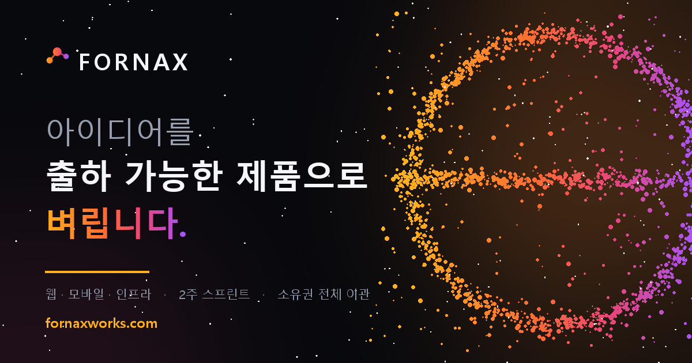

# Taeyang

**AI · 풀스택 개발자 — 기획부터 배포까지 혼자 끝냅니다**

*Full-stack developer focused on AI. Spec to deployment, end to end.*

---

## About

- 🎓 **소프트웨어공학 학사**(중국, 6년) · **인공지능 석사** — 논문 두 편 모두 이론이 아니라 돌아가는 시스템을 만들었습니다
- 🔨 **[fornaxworks](https://fornaxworks.com)** 운영 — 웹 · 모바일 · AI 제품을 기획부터 인수인계까지 한 흐름으로
- 🎮 **[owogg.com](https://owogg.com)** 개발 · 운영 중 — 브라우저 미니게임 플랫폼
- 🏢 2023년부터 **유학 컨설팅 사업체 대표** — 고객 응대 · 계약 · 행정을 실무로
- 🌏 **한국어 · 중국어** — 중국에서 6년간 수학, 학사 논문을 중국어로 집필

<b>English</b>

 

Full-stack developer focused on AI. BSc in Software Engineering (6 years in China), MSc in Artificial Intelligence — both theses shipped working systems rather than theory alone.

Currently running **[fornaxworks](https://fornaxworks.com)**, a studio taking web/mobile/AI products from spec through handover, and building **[owogg.com](https://owogg.com)**, a browser mini-game platform in production.

Also a business owner since 2023, running a study-abroad consulting agency — client relations, contracts, and operations handled first-hand.

Working languages: Korean, Chinese.

---

## Selected Projects

| 프로젝트 | 무엇 | 스택 |
|---|---|---|
| **[project-owogg](https://github.com/TaeyanG4/project-owogg)** → [owogg.com](https://owogg.com) | 브라우저 미니게임 플랫폼. 자체 게임과 사용자 업로드 게임을 하나의 런타임에서 실행. Ports/Adapters로 도메인 분리, e2e 테스트, staging 환경 운영. | `React 19` `Hono` `Cloudflare Workers` `D1` `B2` |
| **[dexon-smart-ops-chatbot](https://github.com/TaeyanG4/dexon-smart-ops-chatbot)** | HDD SMART 데이터로 7일 고장 위험을 예측하고 점검 우선순위 · 근거 문서 · 운영 Runbook을 제시. 공개 전 추적 파일 252개 전수 개인정보 감사를 거쳐 릴리스. | `FastAPI` `LlamaIndex` `LiteLLM` `Langfuse` `Docker` |
| **[story_maker_with_photos](https://github.com/TaeyanG4/story_maker_with_photos)** | 사진 한 장으로 동화를 만드는 인터랙티브 스토리 플랫폼. 시스템 설계 · UX · 비즈니스 전략까지 정식 문서화. | `GPT-4o` `DALL·E 3` `Gradio` |
| **[project-forge](https://github.com/TaeyanG4/project-forge)** → [fornaxworks.com](https://fornaxworks.com) | 스튜디오 사이트 그 자체. 프레임워크 없이 Python 스크립트로 직접 굽는 정적 사이트 + Worker. | `Python` `Cloudflare Workers` |
| **[kapt_predict](https://github.com/TaeyanG4/kapt_predict)** 공개 예정 | 공동주택 공사비 예측 모델. 직접 만든 크롤러 **[kapt_crawler](https://github.com/TaeyanG4/kapt_crawler)** 로 수집한 K-APT 공개 데이터 기반. | `CatBoost` `pandas` |

---

## Research

**석사 논문 · 2026** — 건국대학교 정보통신대학원
[**경량 파이프라인 컨트롤러를 통한 질의 인식 기반 비용 효율적 RAG**](https://www.riss.kr/link?id=T17380351)
*Query-Aware Cost-Efficient RAG via a Lightweight Pipeline Controller*

> 모든 질의에 같은 고비용 파이프라인을 적용할 때 생기는 비용 · 지연 낭비를, 질의 난이도를 먼저 판단해 하이브리드 검색 · 재랭킹 · HyDE를 선택적으로 켜는 경량 컨트롤러로 해결.

**학사 논문 · 2020** — 동북전력대학교 (Northeast Electric Power University)
**Parallelization of Data Mining in Power Industry Based on MapReduce**
基于MapReduce的电力行业数据挖掘并行化实现

> 3노드 Hadoop 클러스터를 직접 구축하고, MapReduce 기반 K-means로 스마트미터 전력 사용 패턴을 병렬 클러스터링.

---

## Tech Stack

**주력은 Python · TypeScript 기반의 AI/풀스택**이며, 아래는 실제로 다뤄본 범위 전체입니다.

**Language**

**AI / ML**

**Backend**

**Frontend**

**Infra / Data**

---

## Certifications

| 데이터 · AI | 개발 · 인프라 |
|---|---|
| 빅데이터분석기사 Big Data Analytics Engineer | 프로그래밍기능사 Craftsman Programming |
| 데이터아키텍처준전문가 DAsP | 리눅스마스터 2급 Linux Master Lv.2 |
| SQL 개발자 SQLD | |
| 데이터분석준전문가 ADsP | |
| AICE Associate KT · 한국경제신문 | |
| AI-POT 1급 AI Prompt Utilization, KPC | |

---

## Education

| 기간 | 과정 |
|---|---|
| ~ 2026.02 | **건국대학교 정보통신대학원** 융합정보기술학과 인공지능전공 — 석사 |
| 2026 | **이어드림스쿨 6기** 중소벤처기업부 AI 기술인력 양성 · 심화과정 LLM Fine-tuning · RAG/Vector DB · LangChain/LangGraph · AI Agent/MCP · 산업 연계 팀 프로젝트 |
| 2022.10 ~ 2023.04 | **AI Bootcamp 16기** — 인공지능모델링 6개월 학습 + 1개월 기업 협업 프로젝트 |
| 2014.09 ~ 2020.06 | **동북전력대학교**(China) 소프트웨어공학과 — 학사 |

---

## Problem Solving

생성형 AI가 코드를 대신 써주기 한참 전, 백준에서 **1,936문제**를 손으로 풀었습니다. solved.ac #3,324
이 카드를 만들어주던 사이트는 이제 없지만, 그 시절 기록은 남겨둡니다.

*Before AI could write code for you — 1,936 problems solved by hand. The site that generated this card is gone now; this stays in its memory.*

---

신규 프로젝트 문의는 <a href="https://fornaxworks.com">fornaxworks.com</a> 에서 받고 있습니다.

