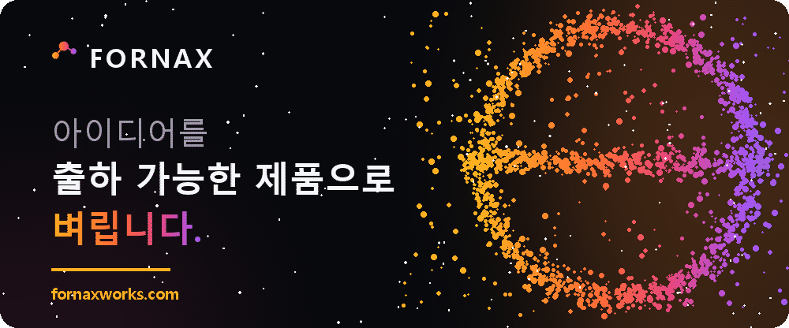
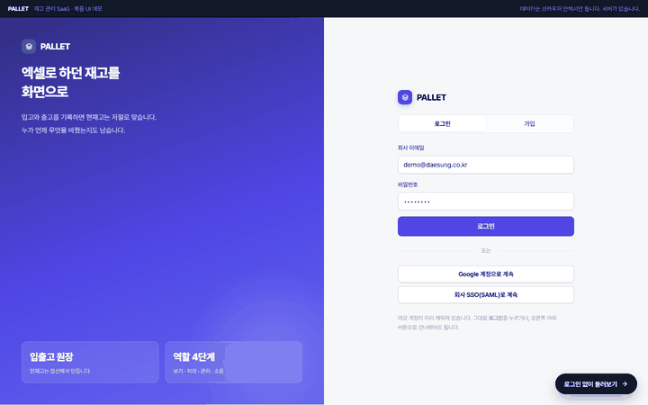
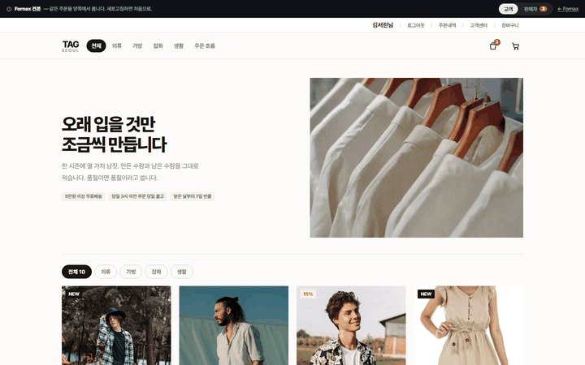
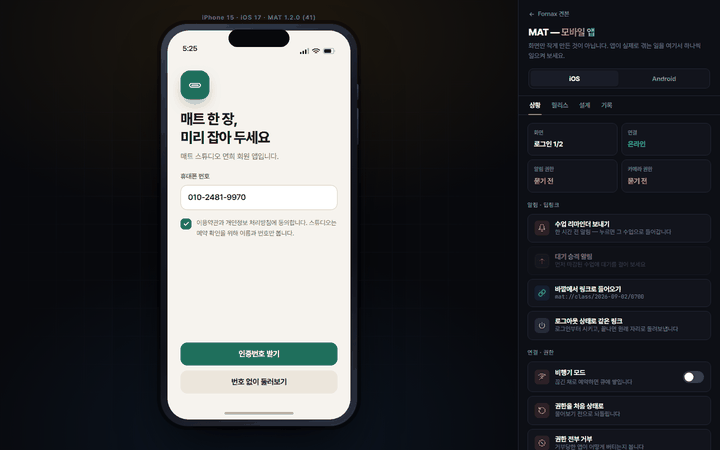
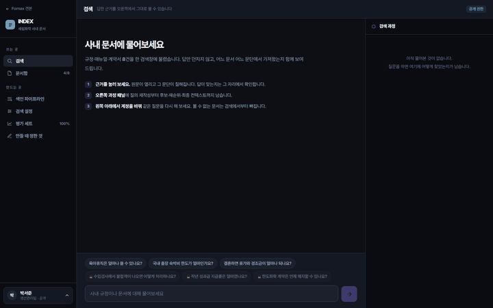
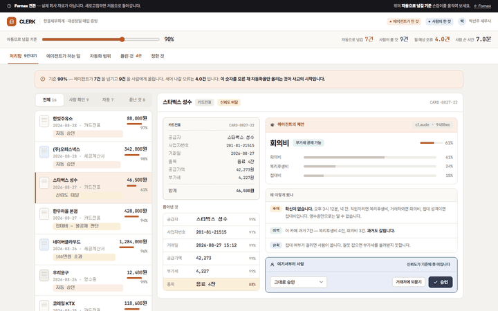
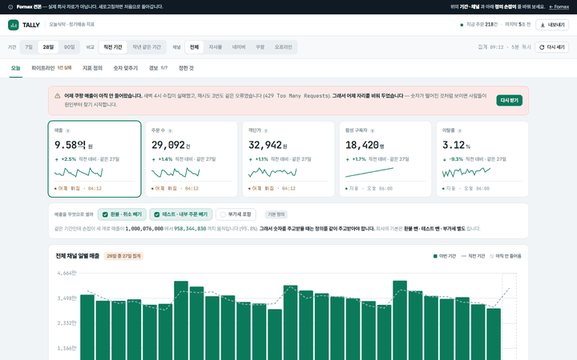
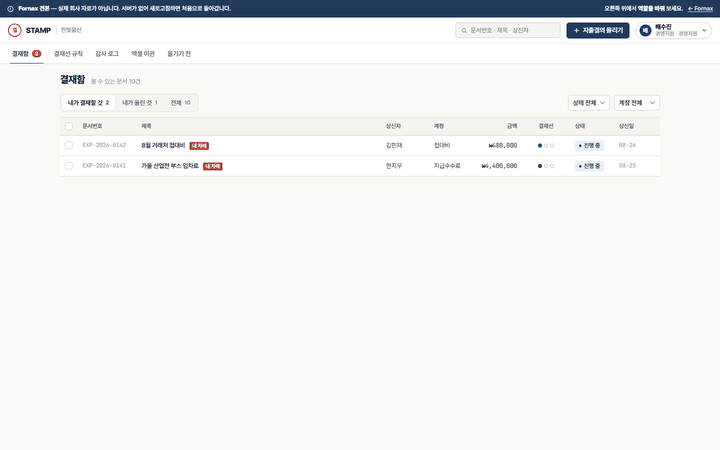
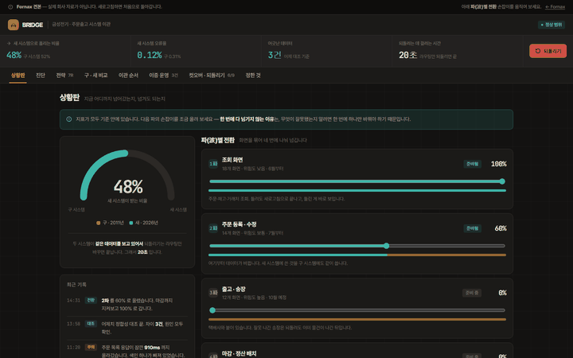
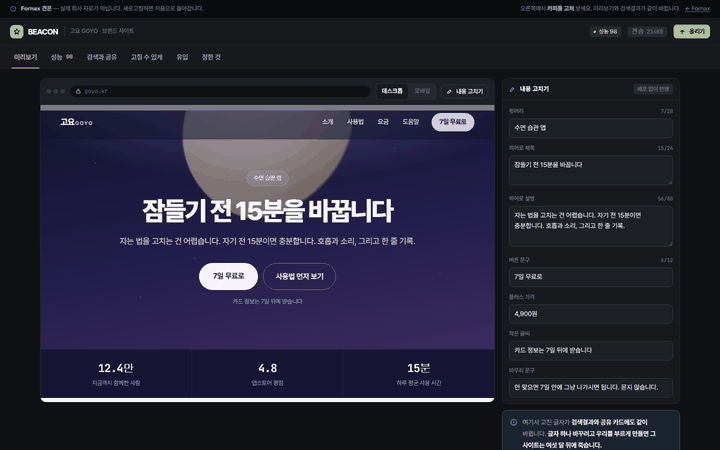

### AI 与全栈开发。从策划到部署，由一个人一路负责到底。

**[https://fornaxworks.com](https://fornaxworks.com)**

[한국어](README.md) | [English](README.en.md) | **中文** | [日本語](README.ja.md)

 

---

## About

 

建国大学信息通信研究生院人工智能专业硕士。此前在中国攻读软件工程本科四年，毕业论文以中文撰写。
硕士论文处理 RAG 的成本问题，本科论文处理电力数据的规模问题。

目前以 [fornaxworks](https://fornaxworks.com) 的名义承接 Web、移动端与 AI 产品开发。
自 2023 年起以负责人身份经营留学咨询公司，客户沟通、合同与行政事务是本来就在做的工作。
除韩语外，可使用英语、中文、日语沟通。

 

---

## Projects

 

| Project | Description | Stack |
|---|---|---|
| **[project-owogg](https://github.com/TaeyanG4/project-owogg)** [owogg.com](https://owogg.com) | 浏览器小游戏平台。自研游戏与用户上传游戏运行在同一套运行时上。以 Ports/Adapters 分离领域逻辑，并运行 e2e 测试与 staging 环境。 | `React 19` `Hono` `Cloudflare Workers` `D1` `B2` |
| **[dexon-smart-ops-chatbot](https://github.com/TaeyanG4/dexon-smart-ops-chatbot)** | 基于 HDD SMART 数据预测七天内可能故障的磁盘，并给出巡检顺序、依据文档与运维 Runbook。公开前对 252 个被跟踪文件做了全量审查，清除了个人信息。 | `FastAPI` `LlamaIndex` `LiteLLM` `Langfuse` `Docker` |
| **[story_maker_with_photos](https://github.com/TaeyanG4/story_maker_with_photos)** | 把一张照片变成童话的互动故事平台。作为研究生课程作业，用 32 页文档整理了系统设计、UX 与商业策略。 | `GPT-4o` `DALL·E 3` `Gradio` |
| **[project-forge](https://github.com/TaeyanG4/project-forge)** [fornaxworks.com](https://fornaxworks.com) | 工作室官网本身。不用框架，由 Python 脚本生成 HTML 并部署到 Cloudflare Worker。Logo 与 OG 图像也由代码绘制。 | `Python` `Cloudflare Workers` |
| **[kapt_predict](https://github.com/TaeyanG4/kapt_predict)** （即将公开） | 住宅小区工程造价预测模型。使用自研爬虫 [kapt_crawler](https://github.com/TaeyanG4/kapt_crawler) 采集的 K-APT 公开数据。 | `CatBoost` `pandas` |

 

---

## Showroom

 

这些是放在 fornaxworks 样品间的演示。并非实际交付物，而是为了展示能做到什么程度而自行制作的样品。
点击图片即可在浏览器中打开。

<table align="center">
<tr>
<td width="33.33%" align="center" valign="top">
 
<b>PALLET</b> Web 服务 
注册、权限、支付一整套 
<code>TypeScript</code> <code>Next.js</code> <code>PostgreSQL</code>
</td>
<td width="33.33%" align="center" valign="top">
 
<b>TAG</b> 电商 
把取消、退货、结算设计成状态流转 
<code>Next.js</code> <code>PostgreSQL</code> <code>Payments</code>
</td>
<td width="33.33%" align="center" valign="top">
 
<b>MAT</b> 移动应用 
一套代码覆盖 iOS 与 Android， 含应用商店审核 
<code>React Native</code> <code>Expo</code>
</td>
</tr>
<tr>
<td width="33.33%" align="center" valign="top">
 
<b>INDEX</b> 文档检索助手 
混合检索与重排序，标注依据段落 
<code>Claude API</code> <code>pgvector</code> <code>FastAPI</code>
</td>
<td width="33.33%" align="center" valign="top">
 
<b>CLERK</b> 重复性业务智能体 
工具调用流水线，最终审批仍由人来做 
<code>Claude API</code> <code>Next.js</code>
</td>
<td width="33.33%" align="center" valign="top">
 
<b>TALLY</b> 数据看板 
比图表更重要的是每天自动保持最新的数据管道 
<code>React</code> <code>Python</code> <code>Airflow</code>
</td>
</tr>
<tr>
<td width="33.33%" align="center" valign="top">
 
<b>STAMP</b> 企业内部业务系统 
按角色划分权限与不可删除的审计日志 
<code>Remix</code> <code>Prisma</code> <code>MySQL</code>
</td>
<td width="33.33%" align="center" valign="top">
 
<b>BRIDGE</b> 遗留系统迁移 
不停机分阶段迁移，可回滚的发布 
<code>Docker</code> <code>Terraform</code> <code>AWS</code>
</td>
<td width="33.33%" align="center" valign="top">
 
<b>BEACON</b> 品牌与落地页 
兼顾性能与检索，并交付为可自行修改的状态 
<code>Next.js</code> <code>Vercel</code>
</td>
</tr>
</table>

 

---

## Research

 

### Master's Thesis

> **[경량 파이프라인 컨트롤러를 통한 질의 인식 기반 비용 효율적 RAG](https://www.riss.kr/link?id=T17380351)**
>
> Query-Aware Cost-Efficient RAG via a Lightweight Pipeline Controller 2026，建国大学信息通信研究生院
>
> 如果所有查询都走同一条高成本流水线，简单问题也要付出同样的成本与延迟。
> 因此加入了一个轻量控制器：先估计查询难度，只在需要时才启用混合检索、重排序与 HyDE。

### Bachelor's Thesis

> **Parallelization of Data Mining in Power Industry Based on MapReduce**
>
> 基于MapReduce的电力行业数据挖掘并行化实现 2020，东北电力大学
>
> 智能电表产生的用电数据量，单机已经无法处理。
> 在虚拟机上搭建三节点 Hadoop 集群，用 MapReduce K-means 对用电模式进行了聚类划分。

 

---

## Tech Stack

 

### Language

### AI / ML

### Backend / Frontend

### Infra / Data

 

---

## Certifications & Education

 

<table align="center" width="100%">
<tr>
<th width="42%">Data &amp; AI</th>
<th width="34%">Dev &amp; Infra</th>
<th width="24%">Language</th>
</tr>
<tr>
<td valign="top" nowrap>

- 大数据分析工程师
- 数据架构准专家 (DAsP)
- SQL 开发者 (SQLD)
- 数据分析准专家 (ADsP)
- AICE Associate
- AI-POT 一级

</td>
<td valign="top" nowrap>

- 信息处理工程师
- 编程技能士
- Linux Master 二级
- 网络管理师 二级
- 计算机应用能力 一级

</td>
<td valign="top" nowrap>

- HSK 五级

</td>
</tr>
</table>

<table align="center" width="100%">
<tr>
<th width="24%">Period</th>
<th>Program</th>
</tr>
<tr>
<td nowrap valign="top">2026.05 ~ 2026.08</td>
<td>

<b>Yeardream School 第6期</b> 进阶课程 韩国中小风险企业部 AI 技术人才培养

- LLM 微调、RAG 与向量数据库
- LangChain 与 LangGraph、AI Agent 与 MCP
- 产业联动团队项目

</td>
</tr>
<tr>
<td nowrap valign="top">2023.09 ~ 2026.02</td>
<td>

<b>建国大学信息通信研究生院</b> 融合信息技术学科 人工智能专业 硕士

</td>
</tr>
<tr>
<td nowrap valign="top">2022.10 ~ 2023.04</td>
<td>

<b>AI Bootcamp 第16期</b> 人工智能建模 6个月学习 + 1个月企业协作

</td>
</tr>
<tr>
<td nowrap valign="top">2014.09 ~ 2020.06</td>
<td>

<b>东北电力大学</b>（中国）软件工程 本科 四年制，在学期间服兵役1年9个月

</td>
</tr>
</table>

 

---

## Algorithms

 

*Thanks, BOJ. Good bye, BOJ.*

---

### 新项目咨询请访问 [fornaxworks.com](https://fornaxworks.com)。

